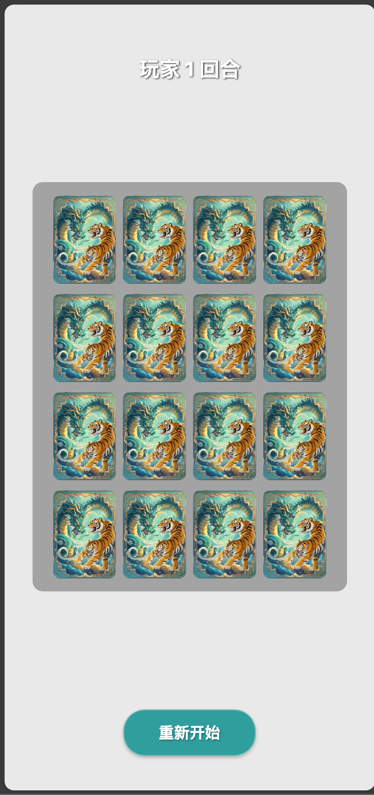
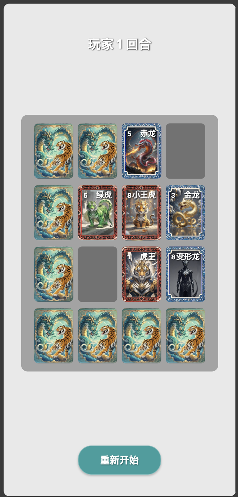

# 游戏名称

## 龙虎斗

一款我儿时和小伙伴一起玩的卡牌游戏。同样类型的还有，军师旅团营；刀杀鸡；动物牌 等。

# 游戏规则

1. 游戏由两名玩家进行，分别控制龙和虎。玩家 1 控制虎，玩家 2 控制龙。
2. 玩家轮流进行操作，每次可以翻开一张牌或者移动自己的生物。
3. 吃牌规则：每个生物都有等级，等级压制的规则如下 
   - 1 > 2 > 3 > 4 > 5 > 6 > 7
   - 2 > 3 > 4 > 5 > 6 > 7 > 8
   - 8 > 1
4. 游戏的目标是吃掉对方所有的生物，或者使对方无法移动。
5. 游戏结束时，胜利的玩家将被宣布为赢家。

# 游戏截图


*游戏主界面展示*


*玩家对战场景*

# DEMO 演示

## 安卓


## IOS
无

# 技术栈
- React Native
- Expo
- Typescript


# 项目启动方法
1. 确保你已经安装了 [Node.js](https://nodejs.org/) 和 [Expo CLI](https://docs.expo.dev/get-started/installation/)。
2. 克隆这个项目到本地：
   ```bash
   git clone <项目的Git地址>
   ```
3. 进入项目目录：
   ```bash
   cd <项目目录>
   ```
4. 安装依赖：
   ```bash
   yarn
   ```
5. 启动项目：
   ```bash
   yarn start
   ```
   这将启动 Expo 开发服务器，并提供一个二维码，你可以使用 Expo Go 应用扫描二维码在手机上运行项目。

